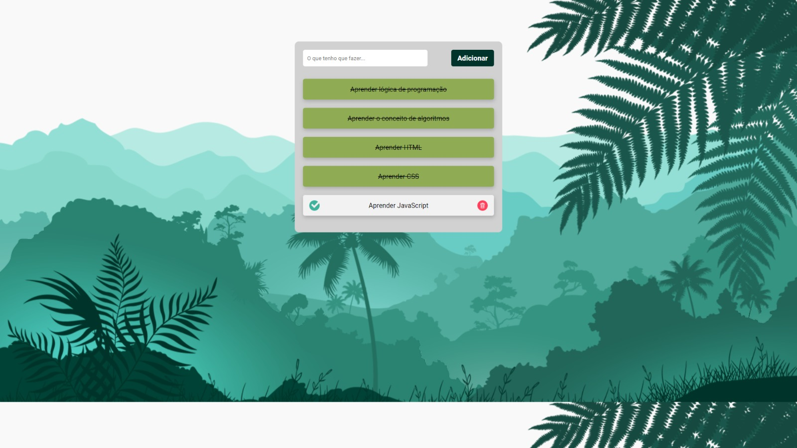

# Projeto HTML, CSS e JavaScript: To Do List
Projeto de HTML, CSS e JavaScript: To Do List. Feito no canal do Youtube da DevClub. A aplicação cria uma lista de tarefas e é capaz de incluir tarefas novas, marcar como concluídas as que foram executadas e remover tarefas indesejadas.

<h1 align="center">
  To Do List
</h1>

  

## 📔 Conhecimentos abordados

* Estrutura HTML
* Classes HTML
* Estilização com CSS
* Importação fontes
* Interatividade com JavaScript
* Utilização de funções e métodos de Array
* Métodos nativos JavaScript
